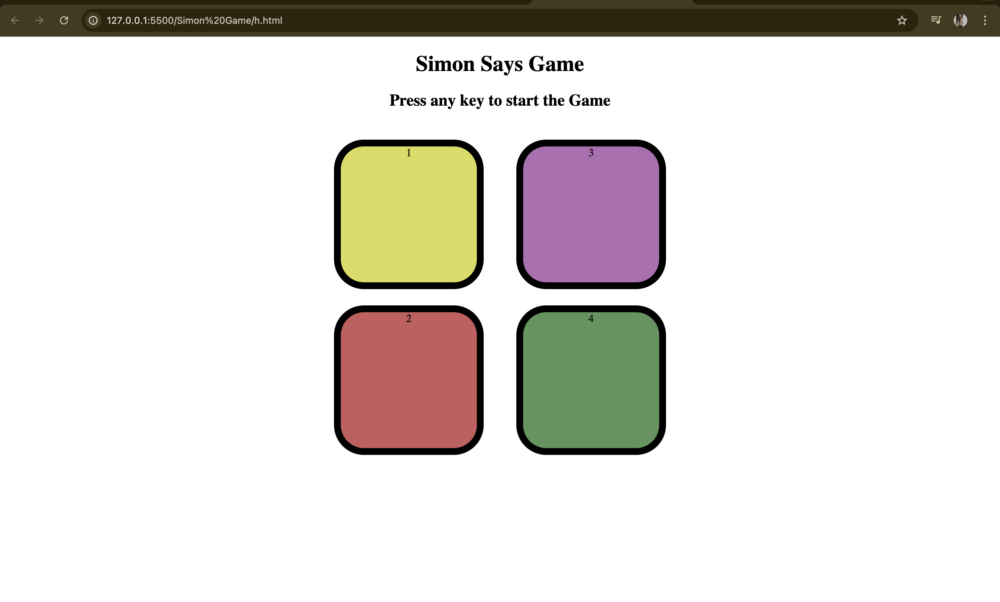

# 🎮 Simon Says Game

A classic Simon Says memory game built using **HTML, CSS, and JavaScript**.

## 🚀 Features
- Start game with keypress
- Random color sequence generation
- User input validation
- Level progression
- Game over and restart functionality

## 🛠 Technologies Used
- HTML
- CSS
- JavaScript (DOM, Events)

## 🎯 How to Play
1. Press any key to start the game
2. Watch the color sequence
3. Click the buttons in the same order
4. Each level adds a new color
5. One wrong move ends the game

## 📸 Preview

## 👩‍💻 Author
**Annu Mathur**